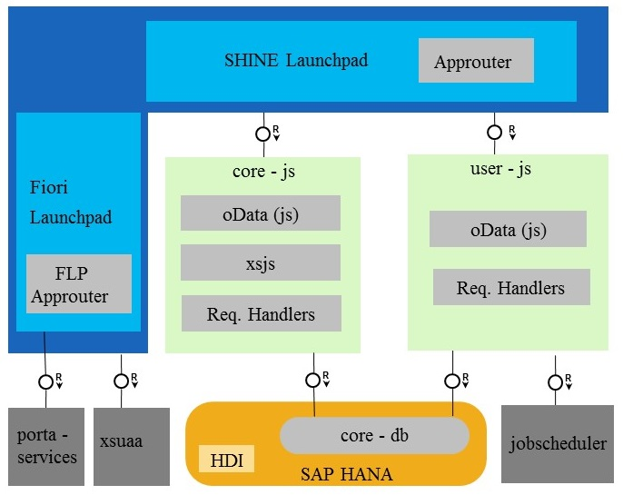
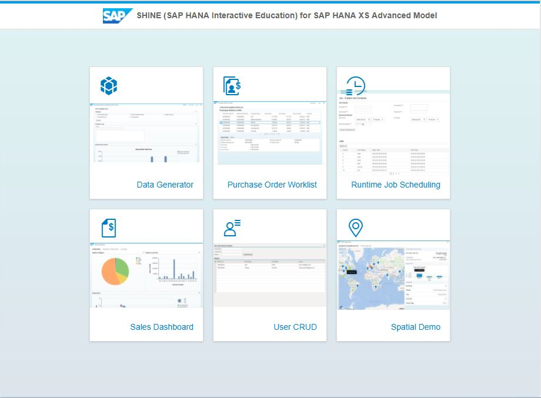
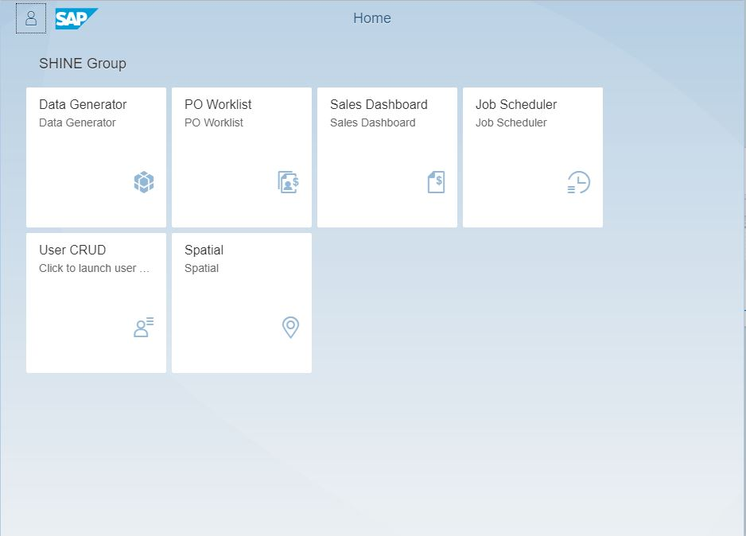

SHINE for the Cloud Foundry Environment within SAP Cloud Platform
===============
SHINE is a Muti-Target Application (MTA) and follows the XS Advanced Programming Model. It consists of the following  packages:

- core-db - This package contains core data model artifacts required to create the tables and other database artifacts (e.g. .hdbcds, .hdbsequence, ...).

- core-js - This package contains the Node.js implementation of Data Generator, Purchase Order Worklist, and Sales Dashboard (backend).

- user-js - This package contains the User CRUD applications implementation in Node.js using XSOData libraries and it also showcases how to use the the job scheduler service in Cloud Foundry for creating and scheduling jobs.

- web - This package contains the user interface for the SHINE Launchpad, Data Generator, Purchase Order Worklist, Sales Dashboard, and User CRUD applications implemented in SAPUI5.

- site-content - This package contains site configuration files required for SAP Fiori Launchpad.

- site-web - This package contains the user interface for the SHINE Fiori Launchpad, Data Generator, Purchase Order Worklist, Job Scheduler, Sales Dashboard, Spatial, and User CRUD applications implemented in SAPUI5.

Architecture:

This repository contains a version of SHINE which is configured to run on the Cloud Foundry environment within SAP Cloud Platform. You can read more about the "[General Availability of the XS Advanced Programming Model with Cloud Foundry on SAP Cloud Platform](https://blogs.sap.com/2017/05/16/general-availability-of-the-xs-advanced-programming-model-with-cloud-foundry-on-sap-cloud-platform/)". The code base of SHINE that is used is version SHINE for XSA SAP HANA 2.0 SPS01.

## Setup MTAR Builder
First, a Multi-Target Application Archive (MTAR) needs to be built from the SHINE code, for this the MTAR Builder is used. Then, in a second step, this MTAR needs to be deployed to the Cloud Foundry environment instance, for this the Cloud Foundry CLI with the MTA Plugin is used.

### Download MTAR Builder
1. Go to [SAP Support Portal](https://launchpad.support.sap.com/#/softwarecenter/support/index)  
2. Click on Support Package and Patches
3. Expand By Alphabetical Index (A-Z)
4. Click on Alphabet M
5. Select MULTITRG APP ARCHIVE BUILDER-> MULTITRG APP ARCHIVE BUILDER 1 ->MTA ARCHIVE BUILDER 1.0
6. Download the latest version of MTAR Builder and rename it to `mta.jar`

### MTAR Builder Pre-requisites
The MTAR Builder needs Java, Git, Apache Maven, and Node.js including npm as pre-requisites. If you have one of the tools already installed you can skip the respective steps but make sure that you do not skip the npm configuration with the SAP NPM Registry.

#### Setup Java
1. Download and install the latest Java SE Development Kit (JDK) from [here](http://www.oracle.com/technetwork/java/javase/downloads/index.html)

#### Setup Git and/or GitHub Desktop
1. Download and install Git from [here](https://git-scm.com/)
2. And/Or download and install GitHub Desktop from [here](https://desktop.github.com/)

#### Setup Apache Maven
1. Download Apache Maven, follow the steps described [here](https://maven.apache.org/download.cgi)
2. Install Apache Maven, follow the steps described [here](https://maven.apache.org/install.html)

#### Setup Node.js and NPM
1. Install Node.js from [here](https://nodejs.org/en/download/).
2. Create a file with name `.npmrc` in your HOME directory. On Windows, that would be `C:/Users/<User Name>`, on macOS, that would be `~/Users/<User Name>`. 
3. Copy the below content to the .npmrc file. With this configuration, you are instructing your npm client installation to download @sap scoped modules from the SAP NPM Registry. All other modules are still downloaded from the default registry. Update all 3 proxy settings (proxy, http-proxy, https-proxy) as per your network settings. If no proxy settings are required mark values of all 3 proxy settings as null.

~~~~

registry=http://registry.npmjs.org/
@sap:registry=https://npm.sap.com/
strict-ssl=false
proxy=http://proxy:8080/
http-proxy=http://proxy:8080/
https-proxy=http://proxy:8080/

~~~~

You can read more about the SAP NPM Registry in "[SAP NPM Registry launched: Making the lives of Node.js developers easier](https://blogs.sap.com/2017/05/16/sap-npm-registry-launched-making-the-lives-of-node.js-developers-easier/)".

## Setup Cloud Foundry Environment Account and CLI
1. If you do not yet have a Cloud Foundry environment trial or enterprise account, signup for a Cloud Foundry environment trial account by following the documentation "[Get a Trial Space on the Cloud Foundry Instance](https://help.sap.com/viewer/65de2977205c403bbc107264b8eccf4b/Cloud/en-US/76e79d62fa0149d5aa7b0698c9a33687.html)"
2. Download and install the Cloud Foundry CLI as described [here](https://help.sap.com/viewer/65de2977205c403bbc107264b8eccf4b/Cloud/en-US/4ef907afb1254e8286882a2bdef0edf4.html)
3. To deploy the MTAR we need the MTA CF CLI plugin, download the MTA CF CLI Plugin from [here](https://tools.hana.ondemand.com/#cloud) 
4. To install the MTA CF CLI Plugin open your CLI and run the command: `cf install-plugin <path to plugin download folder>/cf-cli-mta-plugin-0.7.0-xyz.exe|tar.gz`

## Build the Source Code
1. Clone the SHINE code from this repository to your local drive via Git or GitHub Desktop
2. Switch to branch shine-cf
3. Copy the downloaded mta.jar into the root folder of the SHINE project
4. Logon to your Cloud Foundry environment instance by following the steps explained [here](https://help.sap.com/viewer/65de2977205c403bbc107264b8eccf4b/Cloud/en-US/7a37d66c2e7d401db4980db0cd74aa6b.html)  
*Please note: The Cloud Foundry API endpoints are listed [here](https://help.sap.com/viewer/65de2977205c403bbc107264b8eccf4b/Cloud/en-US/350356d1dc314d3199dca15bd2ab9b0e.html), for the Cloud Foundry environment in Frankfurt it's https://api.cf.eu10.hana.ondemand.com and for the Cloud Foundry environment in Virginia it's https://api.cf.us10.hana.ondemand.com.*
> The Job Scheduler service is used by SHINE, therefore this needs to be available. Currently, the Job Scheduler service is only available in the Cloud Foundry environments in Frankfurt and Virginia, not in the beta in California. Therefore, the installation of SHINE into the Cloud Foundry environment in California would fail. Please install SHINE only in the Cloud Foundry environments in Frankfurt and Virginia.
5. Run the command `cf marketplace` and check for the service name for hana in your account (it could be hanatrial or hana, it depends if you are using a trail or enterprise account)
6. In line no. 141 of mta.yaml update the service name to hanatrial or hana based on your account
7. In line no. 178 of mta.yaml update the url property of the controller to the Cloud Foundry API endpoint of the region you are using (see above).
8. Check the Cloud Foundry org and space names to which you are planning to deploy.
> The Multi-target Application Archive (MTAR), which is obtained after following the build steps described here, cannot be deployed into Cloud Foundry orgs or spaces with white spaces in the name (e.g. "My Space") due to a limitation from the deploy service. Therefore, the installation of the SHINE MTAR into Cloud Foundry orgs or spaces with white spaces in the name (e.g. "My Space") would fail. Please install the SHINE MTAR only into Cloud Foundry orgs or spaces without white spaces in the name  (e.g. "MySpace" or "My_Space").
9. If the Cloud Foundry org or space, to which you are planning to deploy, has any special characters in the name other than the permissible 'a'-'z', 'A'-'Z', '0'-'9', '_', '-', '\', and '/', open the file xs-security.json under the shine-cf project root folder and edit line no. 2 `${org}-${space}-shine-admin`. Change the value to `"your-org-name-without-special-characters"-"your-space-name-without-special-characters"-shine-admin`, e.g. `p1726482trial_trial-dev_cf-shine-admin` althrough my org name is "p1726482trial_trial" and space name is "dev@cf".
10. In your CLI in the SHINE project root folder run the command: `java -jar mta.jar --build-target=CF --mtar=shine-cf.mtar build`  
> You might notice that the build is too slow. This is because of an issue with [npm](https://github.com/npm/npm/issues/11028) when behind a proxy server. In such cases please run the build from an environment without a proxy.
11. An MTAR with the name shine-cf.mtar was generated.

## Deploy the MTAR
1. SHINE needs Cloud Foundry resources as described below. Therefore, this amount of resources should be assigned in Quota Management (on Global Account level) and free (overview on Subaccount level) before SHINE deployment (e.g. what you get with the Cloud Foundry Trail is sufficient):
    1.	Quota Management
        1.	Application Runtime: MEMORY 1
        2.	HANA: hdi-shared 1
        3.	Job Scheduler: lite 1
    2.	Resources overview
        1.	5 routes
        2.	5 services
        3.	1 GB instance memory
2. Navigate to your Cloud Foundry org and space where you want to deploy SHINE and where you have the above-mentioned resources assigned and free
3. Run the command: `cf deploy shine-cf.mtar`

## Launch the SHINE Application
SHINE has two entry points: SHINE Launchpad and Fiori Launchpad for SHINE. The steps below specify how to get the URLs for SHINE Launchpad and Fiori Launchpad for SHINE  
1. Run the command: `cf apps`  
2. Locate the URLs for the two Apps with name shine-web and site-web.  
3. shine-web has the url for SHINE Launchpad and  site-web has the url for Fiori Launchpad of SHINE.  
  
### SHINE Web  

### Site Web  
  

## Undeploy the SHINE Application
To undeploy SHINE and delete all its services run the command: `cf undeploy com.sap.refapps.shine -f --delete-services`

## Support
For any question/clarification or report an issue in SHINE for CF Environment please [create an issue](https://github.com/sap/hana-shine-xsa/issues/new/). Please mention `[shine-cf]` in the title to differentiate issue between SHINE for XS Advanced and SHINE for CF Environment

## License
[Apache License 2.0](LICENSE)
