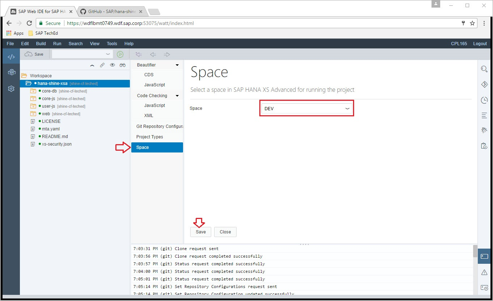
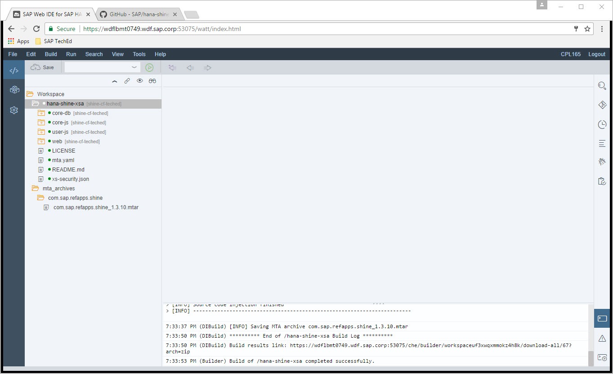
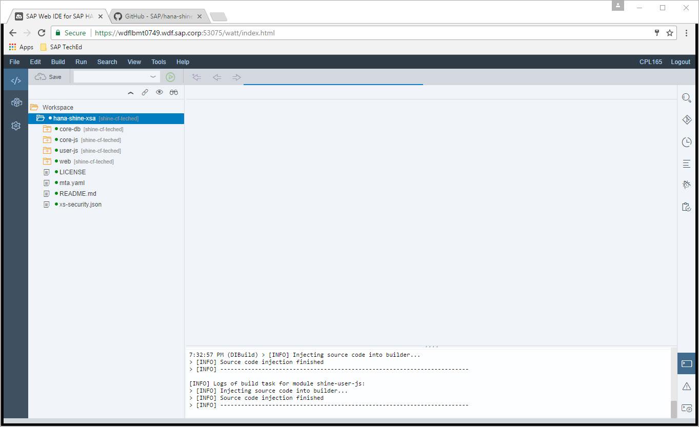
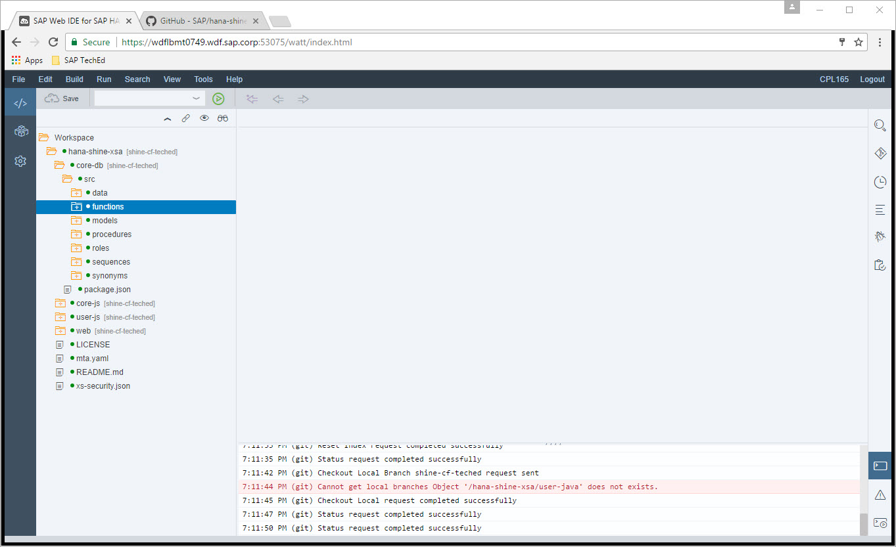

Exercise 02 : Understand SHINE modules and build the application
===============
## Estimated time

15 min

## Objective
In Chapter you will understand the SHINE application have a look at the different modules in SHINE application and build the application

## Exercise Description
### 1. Build the code
1. Right click on folder hana-shine-xsa and click on Project Settings
2. Click on Space and select  DEV space

3. Click on Save
4. Right click on shine-cf folder and click on Build
5. Project would be build an mtar would be generated under folder workspace->mta_archives->com.sap.refapps.shine->com.sap.refapps.shine_1.3.10.mtar

6. Right click on com.sap.refapps.shine_1.3.10.mtar and click on export and download it to folder `D:\Files\Session\CPL165` of your machine
(Note: Download might take sometime so proceed to next step to understand SHINE application code and return back to this step once download is complete)

### 2.  Understand SHINE application code
1. In Web IDE have a look at the various modules in the SHINE application
SHINE consists of below modules
* core-db
* core-js
* user-js
*  web

2. Click on the core-db module
3.The core-db folder contains all the data base artifacts
4. Expand folder core-db->src and explore the database artifacts under folders data, functions, models etc.

5 Click on folder core-js. This folder contains the server side implementation of major features in SHINE like Data Generator, Purchase Order Worklist, Sales Dashboard etc
6. Expand core-js -> routes and you can see all the different REST API handler implementations here.

7. Click on web folder. This folder contains all the user interface artifacts.
8. Expand web ->resources->sales-ui and you will find the UI implementation for Sales Dashboard UI

9. Folder user-js contains code for User CRUD and Job Scheduler tiles
10. Open the xs-security.json. SAP HANA XS Advanced security concept is based on scopes. Scopes are functional authorization units in the context of an application, e.g. the permission to update Master Data. Scopes can be assigned to roles which in turn can be assigned to users. Application can also define a role-template which simplifies the process of creating new roles for administrators. These scopes, roles, role-template etc are defined within xs-security.json. The xs-security.json is provided as parameter while creation of xsuaa service instance 

## Summary
In this exercise you have understood about SHINE code and build SHINE code and generated mtar